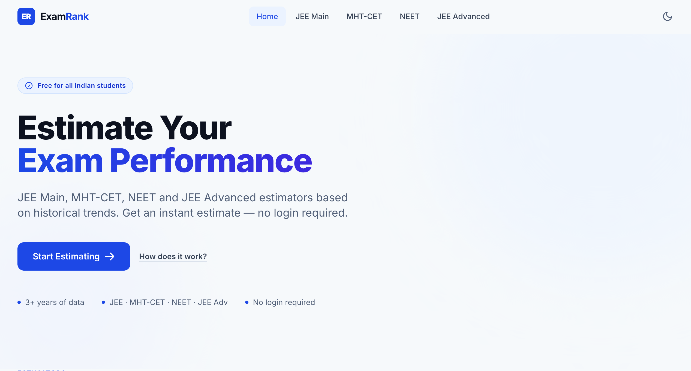
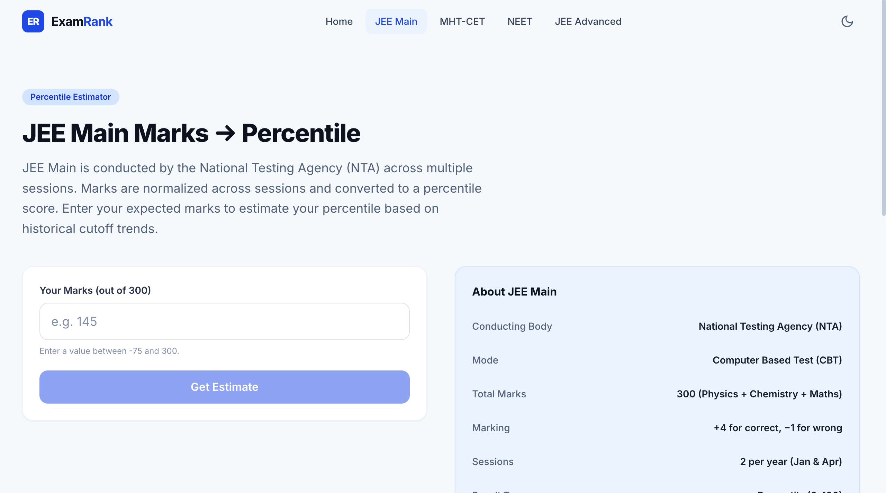
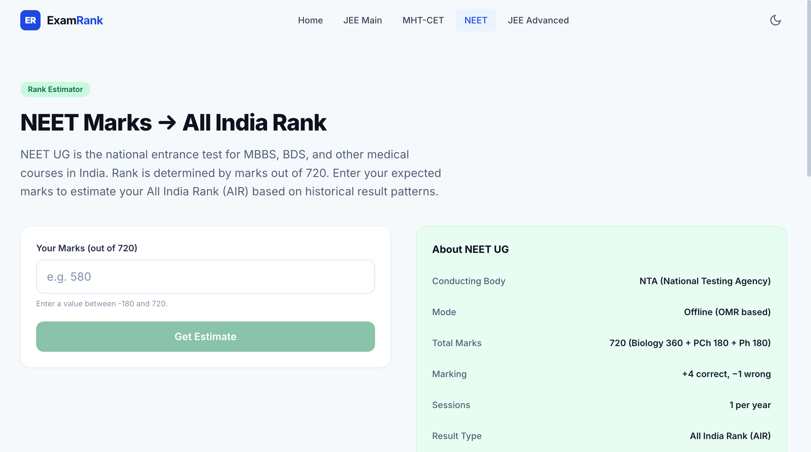
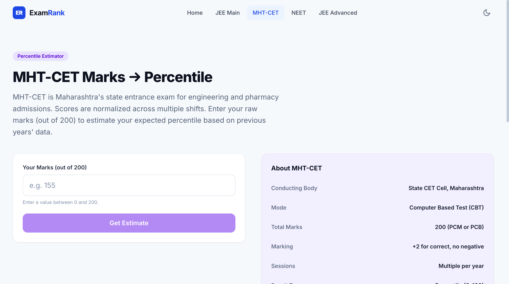
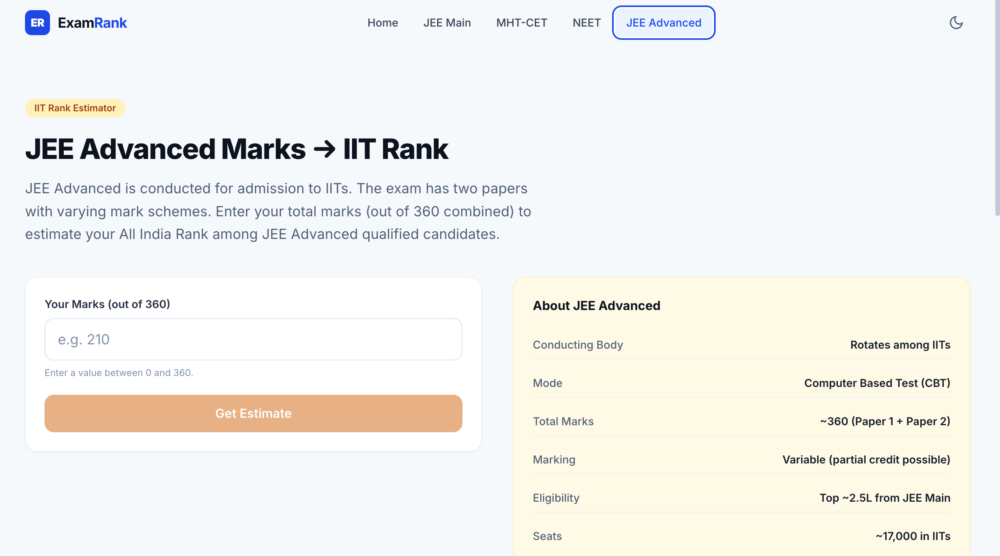

# ExamRank — Indian Entrance Exam Rank & Percentile Estimator

A full-stack web application that helps Indian students estimate their percentile and rank for JEE Main, MHT-CET, NEET UG, and JEE Advanced based on historical result trends. No login required.

---

## 🚀 Live Demo

🌐 Live App: https://examrank-phi.vercel.app
📘 API Docs: _coming soon_
📁 GitHub Repository: https://github.com/DevChinmaysamal17/examrank

---

## ✨ Features

### 🎯 Exam Estimators
- JEE Main — Marks to Percentile & Rank
- MHT-CET — Marks to Percentile & Rank
- NEET UG — Marks to All India Rank
- JEE Advanced — Marks to All India Rank

### 📊 Range-Based Predictions
- Min, Average, and Max percentile estimates
- Min, Average, and Max rank estimates
- Confidence labels — High, Medium, Low
- Based on 3+ years of historical result data (2021–2024)

### ⚡ Performance
- Lazy loaded pages with React Suspense
- Code splitting per route
- Pre-warmed data cache on backend startup
- Linear interpolation engine for instant predictions

### 🎨 UI/UX
- Clean minimal design
- Dark mode with localStorage persistence
- Fully mobile responsive
- Animated score bar on result card
- No login, no signup, no friction

### 🔍 SEO
- Per-page meta titles and descriptions
- Canonical URLs
- OpenGraph tags
- JSON-LD structured data
- Legal pages — About, Privacy Policy, Disclaimer

---

## 🛠️ Tech Stack

| Layer | Technologies |
|---|---|
| Frontend | React 19, Vite, Tailwind CSS, React Router DOM |
| Backend | FastAPI, Pydantic, Uvicorn |
| Data | JSON files with historical trend data |
| HTTP Client | Axios |
| SEO | React Helmet Async |
| Deployment | Render (backend), Vercel (frontend) |
| Tools | Git, GitHub, REST API |

---

## 🏗️ Architecture

```text
Browser (React 19 + Vite)
        ↓  POST /predict/jee  { "marks": 140 }
FastAPI Backend (Uvicorn)
        ↓
Prediction Engine (Linear Interpolation)
        ↓
JSON Historical Data Files
        ↓
{ percentile_avg, rank_avg, rank_min, rank_max, confidence }
```

---

## 📸 Screenshots

### Home Page


---

### JEE Main Estimator


---

### NEET Estimator


---

### MHT-CET Estimator


---

### JEE Advanced Estimator


---

### Home Card


---

### Mobile View


---

## 📁 Project Structure

```text
examrank/
│
├── backend/
│   ├── routers/
│   │   ├── jee.py
│   │   ├── mhtcet.py
│   │   ├── neet.py
│   │   └── jeeadv.py
│   ├── services/
│   │   └── predictor.py
│   ├── schemas/
│   │   └── prediction.py
│   ├── utils/
│   │   └── loader.py
│   ├── data/
│   │   ├── jee.json
│   │   ├── mhtcet.json
│   │   ├── neet.json
│   │   └── jeeadv.json
│   ├── main.py
│   └── requirements.txt
│
├── frontend/
│   ├── public/
│   ├── src/
│   │   ├── components/
│   │   │   ├── Navbar.jsx
│   │   │   ├── Footer.jsx
│   │   │   ├── Hero.jsx
│   │   │   ├── PredictorCard.jsx
│   │   │   ├── PredictorForm.jsx
│   │   │   ├── LoadingSpinner.jsx
│   │   │   └── SEOSection.jsx
│   │   ├── pages/
│   │   │   ├── Home.jsx
│   │   │   ├── Jee.jsx
│   │   │   ├── Mhtcet.jsx
│   │   │   ├── Neet.jsx
│   │   │   ├── JeeAdvanced.jsx
│   │   │   ├── About.jsx
│   │   │   ├── Privacy.jsx
│   │   │   ├── Disclaimer.jsx
│   │   │   └── NotFound.jsx
│   │   ├── services/
│   │   │   └── api.js
│   │   ├── utils/
│   │   │   └── constants.js
│   │   ├── styles/
│   │   │   └── globals.css
│   │   ├── App.jsx
│   │   └── main.jsx
│   ├── index.html
│   ├── package.json
│   ├── vite.config.js
│   └── tailwind.config.js
│
├── screenshots/
│   ├── home.png
│   ├── jee.png
│   ├── neet.png
│   ├── mhtcet.png
│   ├── jeeadvanced.png
│   ├── result.png
│   └── mobile.png
│
├── README.md
└── .gitignore
```

---

## 🔌 API Endpoints

### Health Check

| Method | Endpoint | Description |
|---|---|---|
| GET | `/` | API status check |

---

### Predictions

| Method | Endpoint | Exam | Marks Range |
|---|---|---|---|
| POST | `/predict/jee` | JEE Main | −75 to 300 |
| POST | `/predict/mhtcet` | MHT-CET | 0 to 200 |
| POST | `/predict/neet` | NEET UG | −180 to 720 |
| POST | `/predict/jeeadv` | JEE Advanced | 0 to 360 |

### Request
```json
{
  "marks": 140
}
```

### Response
```json
{
  "exam": "jee",
  "marks": 140,
  "percentile_min": 94.0,
  "percentile_avg": 95.6,
  "percentile_max": 97.2,
  "rank_min": 33600,
  "rank_avg": 52800,
  "rank_max": 72000,
  "confidence": "High",
  "message": "Estimated using historical trend data."
}
```

---

## ⚙️ Local Setup

### Prerequisites
- Node.js 18+
- Python 3.12+
- npm

---

### 1. Clone Repository

```bash
git clone https://github.com/DevChinmaysamal17/examrank.git
cd examrank
```

---

### 2. Backend Setup

```bash
cd backend

# Create virtual environment
python -m venv venv

# Activate — Mac/Linux
source venv/bin/activate

# Activate — Windows
venv\Scripts\activate

# Install dependencies
pip install -r requirements.txt

# Run backend
uvicorn main:app --reload --port 7000
```

Backend runs at: `http://localhost:7000`
API docs at: `http://localhost:7000/docs`

---

### 3. Frontend Setup

```bash
cd frontend

# Install dependencies
npm install --legacy-peer-deps

# Run frontend
npm run dev
```

Frontend runs at: `http://localhost:3000`

---

### 4. Open in Browser

```
http://localhost:3000
```

> ⚠️ Both backend and frontend must be running simultaneously in separate terminals.

---

## 🚀 Deployment

### Backend → Render
- Connect GitHub repo to Render
- Set root directory to `backend/`
- Build command: `pip install -r requirements.txt`
- Start command: `uvicorn main:app --host 0.0.0.0 --port $PORT`

### Frontend → Vercel
- Connect GitHub repo to Vercel
- Set root directory to `frontend/`
- Build command: `npm run build`
- Output directory: `dist`
- Add environment variable: `VITE_API_URL=https://your-render-url.onrender.com`

---

## 🗺️ Future Improvements

- [ ] CUET UG estimator
- [ ] BITSAT estimator
- [ ] KCET estimator
- [ ] College predictor based on rank
- [ ] Category-wise rank prediction (OBC, SC, ST)
- [ ] Year-wise trend comparison charts
- [ ] Share result as image
- [ ] PWA support for offline use

---

## 👨‍💻 Author

## Chinmay Samal

First-Year Engineering Student focused on Backend Development, Cloud & DevOps.

- GitHub: https://github.com/DevChinmaysamal17
- LinkedIn: https://www.linkedin.com/in/chinmaysamal

---

## ⚠️ Disclaimer

This tool provides estimates based on historical trends and is **not an official source**. Not affiliated with NTA, IIT, or any exam authority. Always verify with official result portals.
